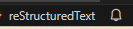

git学习记录
#############

记录一点初学git的没记住的知识点，写了就是学到了。

----------------

目录

.. 因为Furo主题已经自带目录，强制忽略了错误警告
.. contents::
    :depth: 3
    :local:
    :class: this-will-duplicate-information-and-it-is-still-useful-here

----------------

GitHub Desktop部分操作
**************************

GitHub支持修改的部分提交commit |inline-icon| askewsgnvvbnbnghjghjmn  |inline-icon| 

