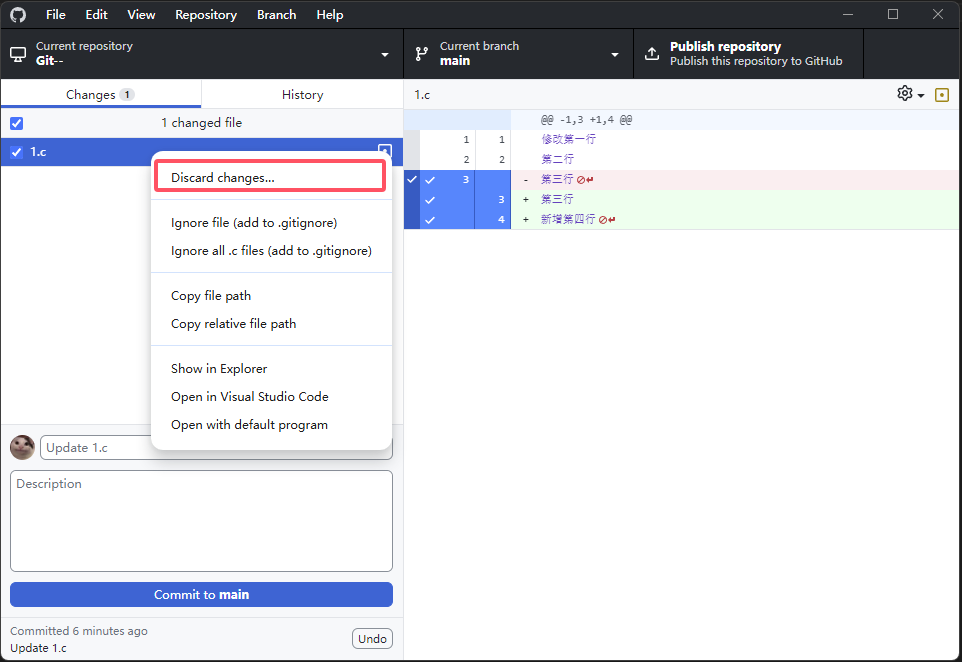
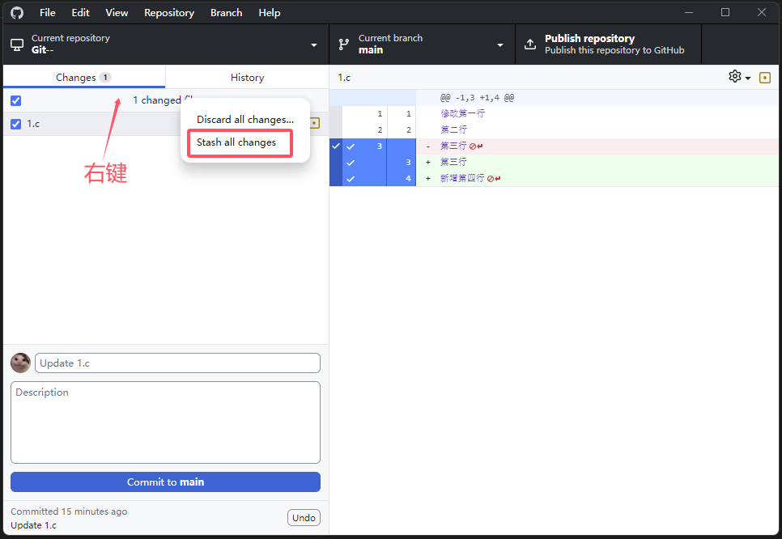
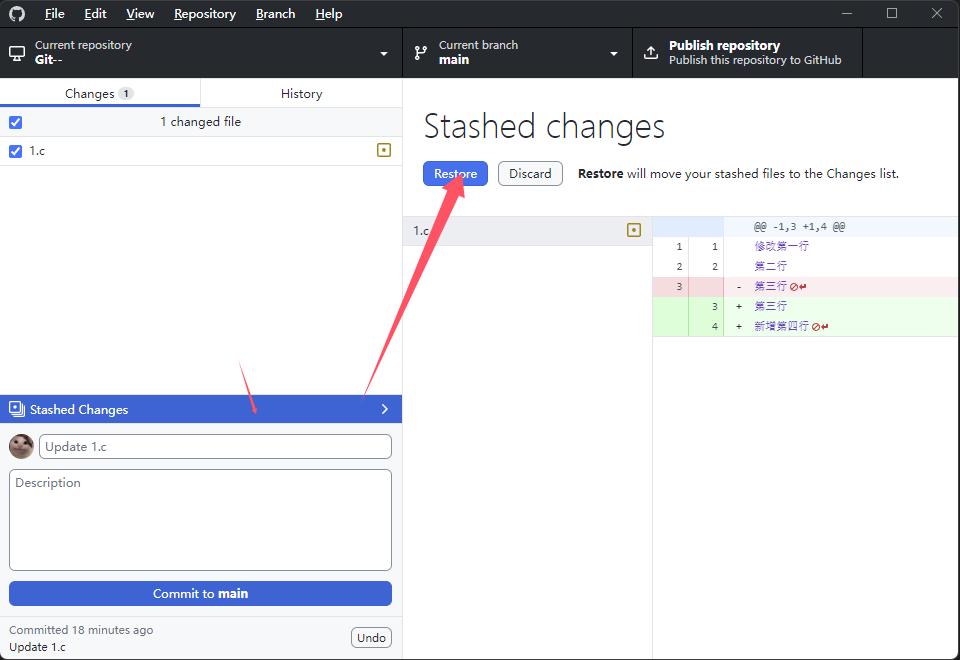
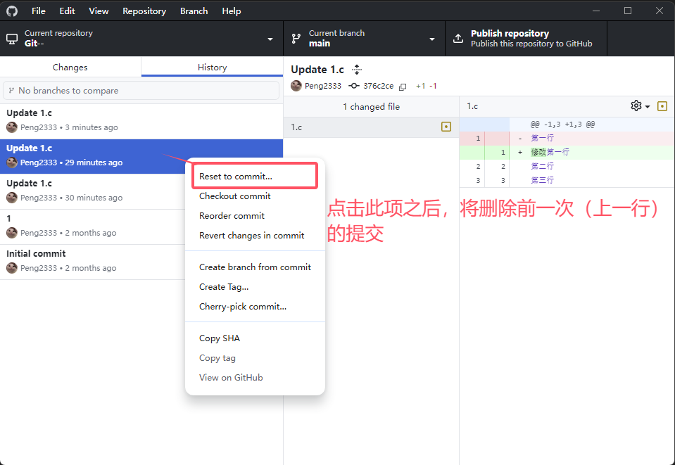

git学习记录
#############

记录一点初学git的没记住的知识点。虽然脑子没记住，但是写了就是学到了。
（部分简单的笔记就不添加图片了）

    该部分对大家应该没什么帮助，多半是作为笔记简单记录一点。

----------------

目录

.. 因为Furo主题已经自带目录，强制忽略了错误警告
.. contents::
    :depth: 3
    :local:
    :class: this-will-duplicate-information-and-it-is-still-useful-here

----------------

git的四个分区
****************

1. Working Directory  工作区
   
2. Staging/Index  暂存区
   
3. Local Repository  本地仓库

4. Remote Repository  远程仓库

GitHub Desktop 软件进阶操作
***********************************

1. 部分提交
=====================

通过勾选软件界面文件修改预览部分前面的对勾，可以选择仅提交部分改动或者取消掉部分改动。

被取消的部分提交改动之后可以接着提交一个新的提交。

适用于分为两个功能单独提交。

2. 放弃更改
======================

通过在文件上右键选择 ``Discard changes...`` 按钮将放弃文件的更改，

文件将被还原至本地分支（本地仓库）的存储内容。同时该修改过的文件会被放至回收站中。

3. git stash
=======================

可以使用此功能将当前修改暂时存储起来，进而可以切换其他分支进行修改。

不过这里不能是同一个文件修改后合并。当然正常工程中是需要在main分支上新开一个分支进行修改。如果遇到原分支有改动需求，也是在另一个分支上操作，并不能出现这种修改到同一个文件的情况。

GitHub desktop软件仅能存储一次，据说命令行可以存储多次分支。

4. 撤回提交 (git reset)
==============================

这个撤回改动，仅仅对git仓库管理文件起作用，实际工程文件的修改还是存在的。

如果是推送到远端的代码，就不能再Reset了，这个按钮会变灰。但是可以使用命令行进行操作。

使用 ``git reset --mix xxxxxxxxxxx``  进行复位，后跟提交的ID（git log命令显示的文件中获取）

因为使用这个之后，远程有一次提交，本地没有，所以Desktop会有一个同步箭头，这里使用强制推送命令
``git push -f`` 将本地的更改记录强制推送到远程。（高危操作）

5. git revert
===========================

使用revert功能，生成一个反向的修改，将仓库（或远程仓库）的提交恢复到之前的一个版本。
这样整个修改记录都在，对于仓库来说，本次提交是用户进行了文件修改，只是改过后的结果和之前的某次相同。

该操作比较安全，推荐使用.

6. Amend commit
=======================

可以使用该功能将最新一次的commit重新修改。
可以修改提交的标题，描述或者代码文件。

已经推送到远端的代码使用此功能后需要使用强制推送到远端，高危操作。

7. tag
===========

可以将提交记录中的某一次提交进行tag，一般用于版本发布时，tag名称可以填入版本号等。

